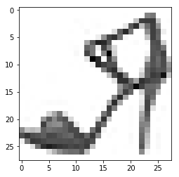
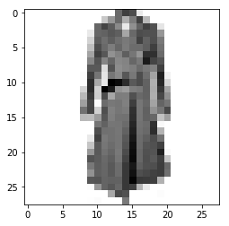

# Zalando example

What does this all cover?
**General (dense layers)**
- Keras
- Multilayer perceptron
- activation functions
- loss function
- matrix notation practice
- hyperparameter testing (trial and error)
- regularization via early stopping (plot validation vs training accuracy)

**CNN**
- convolutional neural nets
- use of all layers: convolution layers, pooling layers, Fully connected layers
- sense of the general layer structure
- show pictures in python
- Visualizing intermediate convnet outputs 
- regularization via dropout
- make a class prediction

**Things I have not done (yet)**
- k-fold cross-validation (yet wonder about the added value at this stage, makes comp time longer. Or should make the data smaller)
- having jpeg images and actually making them manageable to work with (is this done earlier?)
- data augmentation --> need de jpegs to do so
- vanishing/exploding gradients
- L2 regularization
---> sequence processing with convolutional neural networks?


# 1. Introduction

In this example we'll get a sense of just how powerful convolutional neural networks get! This data set, the so-called `Fashion-MNIST` was constructed by a research team at online fashion retailer Zalando.  Fashion-MNIST is a dataset of Zalando's article images—consisting of a training set of 60,000 examples and a test set of 10,000 examples. Each example is a 28x28 grayscale image, associated with a label from 10 classes.


```python
import numpy as np
import tensorflow as tf
import os
import matplotlib.pyplot as plt
import matplotlib.image  as img
```

    /Users/lore.dirick/anaconda3/lib/python3.6/site-packages/h5py/__init__.py:36: FutureWarning: Conversion of the second argument of issubdtype from `float` to `np.floating` is deprecated. In future, it will be treated as `np.float64 == np.dtype(float).type`.
      from ._conv import register_converters as _register_converters


```python
def load_mnist(path, kind='train'):
    import os
    import gzip
    import numpy as np

    """Load MNIST data from `path`"""
    labels_path = os.path.join(path,
                               '%s-labels-idx1-ubyte.gz'
                               % kind)
    images_path = os.path.join(path,
                               '%s-images-idx3-ubyte.gz'
                               % kind)

    with gzip.open(labels_path, 'rb') as lbpath:
        labels = np.frombuffer(lbpath.read(), dtype=np.uint8,
                               offset=8)

    with gzip.open(images_path, 'rb') as imgpath:
        images = np.frombuffer(imgpath.read(), dtype=np.uint8,
                               offset=16).reshape(len(labels), 784)

    return images, labels
```


```python
train_images, train_labels = load_mnist( path = "data_zalando/",kind='train')
test_images, test_labels = load_mnist(path = "data_zalando/", kind='t10k')
```

This is a fairly big data set. If we keep it as such, runtimes will be longer. Let's take samples of this data set, so we work with 10,000 training instances and 2,500 test instances. Do remember that working with bigger data is generally always better when it comes to training models and getting more accurate results, longer computation times are pretty much the only downside!


```python
from random import *
import random
index_train = range(0,59999)
index_test= range(0,9999)

random.seed(1109)
train_sample = sample(index_train,  10000)
test_sample = sample(index_test,  2500)
```


```python
train_images = train_images[train_sample]
train_labels = train_labels[train_sample]
test_images = test_images[test_sample]
test_labels = test_labels[test_sample]
```

Let's verify the shape of the train_images and test_images


```python
np.shape(train_images)
```


    (10000, 784)


```python
np.shape(test_images)
```


    (2500, 784)


You can see that now, there are 10,000 observations in the training set, each representing 1 image of 28 x 28 pixels, so each observation contains 784 inputs that range between [0,255] (for a greyscale image, going from white to black). Similarly, there are 2500 images in the test set. Let's have a look at a random observation from `train_images`, let's say, the 4th observation.


```python
train_images[3]
```


    array([  0,   0,   0,   0,   2,   1,   0,   1,   1,   1,   0, 146, 173,
           138, 141, 146, 173,   0,   0,   3,   1,   1,   1,   0,   0,   0,
             0,   0,   0,   0,   0,   0,   1,   3,   3,   0,   0,   0,  50,
           231, 244, 248, 249, 249, 232, 148,   0,   0,   0,   0,   3,   1,
             0,   0,   0,   0,   0,   0,   0,   0,   2,   0,   0,  12,  97,
           173, 213, 190, 228, 255, 245, 245, 186, 202, 176, 103,  39,   0,
             0,   2,   0,   0,   0,   0,   0,   0,   0,   0,   0,  13, 177,
           191, 203, 199, 197, 181, 186, 219, 225, 203, 169, 191, 198, 207,
           196, 203,  65,   0,   0,   0,   0,   0,   0,   0,   0,   0,   0,
           168, 205, 186, 183, 183, 186, 199, 215, 198, 172, 217, 213, 190,
           180, 181, 183, 194, 196,  43,   0,   0,   0,   0,   0,   0,   0,
             0, 113, 209, 184, 188, 188, 188, 188, 183, 185, 207, 148, 186,
           181, 184, 186, 186, 184, 181, 192, 201,   0,   0,   0,   0,   0,
             0,   0,   0, 185, 201, 191, 190, 190, 189, 189, 187, 197, 195,
           160, 192, 184, 185, 181, 185, 184, 190, 185, 208,  23,   0,   0,
             0,   0,   0,   0,   3, 219, 194, 195, 192, 190, 190, 188, 188,
           191, 202, 187, 189, 181, 186, 187, 179, 183, 180, 179, 207,  61,
             0,   0,   0,   0,   0,   0,  52, 213, 192, 198, 196, 193, 191,
           189, 187, 186, 189, 185, 189, 185, 186, 202, 181, 186, 179, 183,
           205,  99,   0,   0,   0,   0,   0,   0,  88, 201, 188, 213, 220,
           191, 193, 190, 189, 188, 187, 187, 188, 188, 185, 185, 179, 198,
           217, 191, 189, 137,   0,   0,   0,   0,   0,   0, 179, 216, 224,
           247, 208, 201, 201, 194, 192, 189, 189, 188, 189, 187, 191, 191,
           189, 185, 237, 226, 208, 177,   0,   0,   0,   0,   0,   0,  51,
           154, 208, 175,  63, 212, 202, 197, 193, 191, 189, 188, 189, 190,
           190, 190, 202, 133,  87, 220, 140,  27,   0,   0,   0,   0,   0,
             0,   0,   0,   0,   0,  59, 211, 191, 201, 191, 191, 189, 188,
           189, 188, 187, 181, 196, 162,   0,   0,   0,   0,   0,   0,   0,
             0,   0,   0,   0,   0,   0,   0,  82, 211, 192, 202, 191, 192,
           190, 188, 189, 188, 190, 186, 188, 169,   0,   0,   0,   0,   0,
             0,   0,   0,   0,   0,   0,   0,   3,   0,  82, 201, 191, 201,
           191, 192, 190, 188, 189, 188, 191, 191, 188, 164,   0,   0,   0,
             0,   0,   0,   0,   0,   0,   0,   0,   0,   5,   0,  70, 195,
           190, 194, 189, 191, 190, 188, 189, 189, 185, 191, 188, 157,   0,
             0,   0,   0,   0,   0,   0,   0,   0,   0,   0,   0,   5,   0,
            63, 195, 187, 191, 190, 191, 190, 189, 189, 190, 185, 187, 191,
           151,   0,   0,   0,   0,   0,   0,   0,   0,   0,   0,   0,   0,
             5,   0,  66, 198, 186, 192, 190, 191, 190, 189, 189, 189, 189,
           178, 195, 140,   0,   0,   0,   0,   0,   0,   0,   0,   0,   0,
             0,   0,   5,   0,  61, 195, 186, 192, 190, 191, 190, 189, 189,
           190, 188, 178, 194, 135,   0,   0,   0,   0,   0,   0,   0,   0,
             0,   0,   0,   0,   4,   0,  68, 192, 186, 193, 191, 191, 191,
           190, 189, 190, 188, 184, 191, 141,   0,   0,   0,   0,   0,   0,
             0,   0,   0,   0,   0,   0,   5,   0,  74, 193, 185, 194, 192,
           192, 191, 190, 189, 189, 188, 185, 191, 151,   0,   0,   1,   0,
             0,   0,   0,   0,   0,   0,   0,   0,   5,   0,  74, 192, 187,
           194, 192, 192, 193, 192, 189, 187, 188, 185, 192, 165,   0,   0,
             1,   0,   0,   0,   0,   0,   0,   0,   0,   0,   5,   0,  74,
           193, 189, 193, 192, 193, 193, 191, 189, 187, 188, 185, 191, 175,
             0,   0,   1,   0,   0,   0,   0,   0,   0,   0,   0,   0,   5,
             0,  76, 197, 189, 190, 191, 193, 190, 188, 189, 190, 187, 184,
           190, 185,   0,   0,   1,   0,   0,   0,   0,   0,   0,   0,   0,
             0,   5,   0,  77, 197, 189, 189, 191, 192, 190, 190, 189, 189,
           187, 185, 188, 197,   0,   0,   2,   0,   0,   0,   0,   0,   0,
             0,   0,   0,   5,   0,  75, 196, 186, 185, 186, 187, 186, 186,
           186, 186, 181, 184, 185, 172,   0,   0,   3,   0,   0,   0,   0,
             0,   0,   0,   0,   0,   6,   0,  88, 204, 191, 206, 205, 205,
           205, 205, 205, 205, 204, 202, 190, 184,  14,   0,   4,   0,   0,
             0,   0,   0,   0,   0,   0,   0,   4,   0,  63, 175, 138, 140,
           140, 141, 137, 136, 136, 136, 132, 130, 132, 148,   4,   0,   2,
             0,   0,   0,   0], dtype=uint8)


It would be nice if we could actually see what this picture looks like. Note that the form $(n\_obs, total\_n\_pixels)$, which is what we obtained looking at `np.shape(train_images)`, is desirable when training neural networks, but if we want to *visualize* the actual images, we need to reshape $total\_n\_pixels$ to something of the form ($horiz\_pixels$, $vertical\_pixels$). Let's use the numpy function `matrix.reshape` to look at the 4th image.


```python
reshape_example= np.matrix.reshape(train_images[3],28,28)
```

Let's quickly have a look at how this changed the data structure. Notice how you have an 28 x 28 matrix now!


```python
reshape_example
```


    array([[  0,   0,   0,   0,   2,   1,   0,   1,   1,   1,   0, 146, 173,
            138, 141, 146, 173,   0,   0,   3,   1,   1,   1,   0,   0,   0,
              0,   0],
           [  0,   0,   0,   0,   1,   3,   3,   0,   0,   0,  50, 231, 244,
            248, 249, 249, 232, 148,   0,   0,   0,   0,   3,   1,   0,   0,
              0,   0],
           [  0,   0,   0,   0,   2,   0,   0,  12,  97, 173, 213, 190, 228,
            255, 245, 245, 186, 202, 176, 103,  39,   0,   0,   2,   0,   0,
              0,   0],
           [  0,   0,   0,   0,   0,  13, 177, 191, 203, 199, 197, 181, 186,
            219, 225, 203, 169, 191, 198, 207, 196, 203,  65,   0,   0,   0,
              0,   0],
           [  0,   0,   0,   0,   0, 168, 205, 186, 183, 183, 186, 199, 215,
            198, 172, 217, 213, 190, 180, 181, 183, 194, 196,  43,   0,   0,
              0,   0],
           [  0,   0,   0,   0, 113, 209, 184, 188, 188, 188, 188, 183, 185,
            207, 148, 186, 181, 184, 186, 186, 184, 181, 192, 201,   0,   0,
              0,   0],
           [  0,   0,   0,   0, 185, 201, 191, 190, 190, 189, 189, 187, 197,
            195, 160, 192, 184, 185, 181, 185, 184, 190, 185, 208,  23,   0,
              0,   0],
           [  0,   0,   0,   3, 219, 194, 195, 192, 190, 190, 188, 188, 191,
            202, 187, 189, 181, 186, 187, 179, 183, 180, 179, 207,  61,   0,
              0,   0],
           [  0,   0,   0,  52, 213, 192, 198, 196, 193, 191, 189, 187, 186,
            189, 185, 189, 185, 186, 202, 181, 186, 179, 183, 205,  99,   0,
              0,   0],
           [  0,   0,   0,  88, 201, 188, 213, 220, 191, 193, 190, 189, 188,
            187, 187, 188, 188, 185, 185, 179, 198, 217, 191, 189, 137,   0,
              0,   0],
           [  0,   0,   0, 179, 216, 224, 247, 208, 201, 201, 194, 192, 189,
            189, 188, 189, 187, 191, 191, 189, 185, 237, 226, 208, 177,   0,
              0,   0],
           [  0,   0,   0,  51, 154, 208, 175,  63, 212, 202, 197, 193, 191,
            189, 188, 189, 190, 190, 190, 202, 133,  87, 220, 140,  27,   0,
              0,   0],
           [  0,   0,   0,   0,   0,   0,   0,  59, 211, 191, 201, 191, 191,
            189, 188, 189, 188, 187, 181, 196, 162,   0,   0,   0,   0,   0,
              0,   0],
           [  0,   0,   0,   0,   0,   0,   0,  82, 211, 192, 202, 191, 192,
            190, 188, 189, 188, 190, 186, 188, 169,   0,   0,   0,   0,   0,
              0,   0],
           [  0,   0,   0,   0,   0,   3,   0,  82, 201, 191, 201, 191, 192,
            190, 188, 189, 188, 191, 191, 188, 164,   0,   0,   0,   0,   0,
              0,   0],
           [  0,   0,   0,   0,   0,   5,   0,  70, 195, 190, 194, 189, 191,
            190, 188, 189, 189, 185, 191, 188, 157,   0,   0,   0,   0,   0,
              0,   0],
           [  0,   0,   0,   0,   0,   5,   0,  63, 195, 187, 191, 190, 191,
            190, 189, 189, 190, 185, 187, 191, 151,   0,   0,   0,   0,   0,
              0,   0],
           [  0,   0,   0,   0,   0,   5,   0,  66, 198, 186, 192, 190, 191,
            190, 189, 189, 189, 189, 178, 195, 140,   0,   0,   0,   0,   0,
              0,   0],
           [  0,   0,   0,   0,   0,   5,   0,  61, 195, 186, 192, 190, 191,
            190, 189, 189, 190, 188, 178, 194, 135,   0,   0,   0,   0,   0,
              0,   0],
           [  0,   0,   0,   0,   0,   4,   0,  68, 192, 186, 193, 191, 191,
            191, 190, 189, 190, 188, 184, 191, 141,   0,   0,   0,   0,   0,
              0,   0],
           [  0,   0,   0,   0,   0,   5,   0,  74, 193, 185, 194, 192, 192,
            191, 190, 189, 189, 188, 185, 191, 151,   0,   0,   1,   0,   0,
              0,   0],
           [  0,   0,   0,   0,   0,   5,   0,  74, 192, 187, 194, 192, 192,
            193, 192, 189, 187, 188, 185, 192, 165,   0,   0,   1,   0,   0,
              0,   0],
           [  0,   0,   0,   0,   0,   5,   0,  74, 193, 189, 193, 192, 193,
            193, 191, 189, 187, 188, 185, 191, 175,   0,   0,   1,   0,   0,
              0,   0],
           [  0,   0,   0,   0,   0,   5,   0,  76, 197, 189, 190, 191, 193,
            190, 188, 189, 190, 187, 184, 190, 185,   0,   0,   1,   0,   0,
              0,   0],
           [  0,   0,   0,   0,   0,   5,   0,  77, 197, 189, 189, 191, 192,
            190, 190, 189, 189, 187, 185, 188, 197,   0,   0,   2,   0,   0,
              0,   0],
           [  0,   0,   0,   0,   0,   5,   0,  75, 196, 186, 185, 186, 187,
            186, 186, 186, 186, 181, 184, 185, 172,   0,   0,   3,   0,   0,
              0,   0],
           [  0,   0,   0,   0,   0,   6,   0,  88, 204, 191, 206, 205, 205,
            205, 205, 205, 205, 204, 202, 190, 184,  14,   0,   4,   0,   0,
              0,   0],
           [  0,   0,   0,   0,   0,   4,   0,  63, 175, 138, 140, 140, 141,
            137, 136, 136, 136, 132, 130, 132, 148,   4,   0,   2,   0,   0,
              0,   0]], dtype=uint8)


```python
%matplotlib inline
import matplotlib.pyplot as plt
plt.imshow(reshape_example, cmap=plt.cm.binary)
plt.show()
```


Remember that the resolution of this image is pretty low, but for this example it's definitely clear that this is a shirt!

Let's look at the labels. As mentioned, there are 10 classes of clothing in this data set. In the `train_labels` (`test_labels`) data set, this means that there are exactly 10,000 (2500) inputs with each input ranging from [0,9].


```python
np.shape(train_labels)
```


    (10000,)


```python
train_labels
```


    array([4, 6, 2, ..., 8, 1, 0], dtype=uint8)


Although we'll keep this decoded version to train and test our model (actually, we'll decode even further and perform one-hot encoding), it would be nice if we could do a sanity check on our data now and verify that the train instances are labeled correctly. The dictionary `cat_dict` contains the so-called "encoding information", to encode the data back from number to clothing category. The `encoded_labels` object contains the encoded labels. Let's have a look at the 4th observation in the `encoded_labels` and check if the picture we showed before is indeed identified as a dress.


```python
encoded_labels = {0:'T-shirt/Top',
                  1:'Trouser',
                  2:'Pullover',
                  3:'Dress',
                  4:'Coat',
                  5:'Sandal',
                  6:'Shirt',
                  7:'Sneaker',
                  8:'Bag',
                  9:'Ankle Boot'}

encoded_train = [encoded_labels[i] for i in train_labels]
encoded_test = [encoded_labels[i] for i in test_labels]
```


```python
encoded_train[3]
```


    'T-shirt/Top'


This label seems to be correct! By replacing the value passed in `index_test` below, you can look at several pictures and the associated label. 


```python
index_fill = 1376 # replace with any value between 0 and 9999

reshape= np.matrix.reshape(train_images[index_fill],28,28)

import matplotlib.pyplot as plt
plt.imshow(reshape, cmap=plt.cm.binary)
plt.show()

encoded_train[index_fill]
```





    'Sandal'


# 2. Build densely connected network as a baseline

Every time you run a newer, more advanced model on your data, you would want to make sure you compare it with what you have learned. For that reason, let's look at a dense neural network as a baseline before diving into convolutional networks. As data is manipulated slightly differently in convolutional networks, let's perform data manipulation for the dense network, and we'll start over from scratch for the convolutional neural network.

Remember that the image data is stored in an array of shape (10000, 784) of type uint8 with values in the [0, 255] interval. To serve as input for the model, we want transform it into a float32 array of the same shape, but with values between 0 and 1 instead of 0 and 255.  


```python
train_images = train_images.astype('float32') / 255
test_images = test_images.astype('float32') / 255
```

We're not quite done yet. Remember that instead of a label somewhere [0,9], neural networks generally use one-hot encoding. For this exercise, this means that the label for each observation is replaced by a vector containing 9 `0`'s and just 1 `1`, in the place of the label index.

You can use `to_categorical` in `keras.utils` to do this.


```python
from keras.utils import to_categorical
train_labels = to_categorical(train_labels)
test_labels= to_categorical(test_labels)
```

    Using TensorFlow backend.


From our 10,000 training set elements, let set 2000 aside for validation.


```python
img_val = train_images[:2000]
partial_img_train  = train_images[2000:]
label_val = train_labels[:2000]
partial_label_train = train_labels[2000:]
```

Now, let's build our baseline network. You'll build two dense hidden layers, the first one with 128 hidden units, and the second one with 64 hidden units. Use the rectified linear unit as an activation function for both. Remember that the input shape is 28 x 28 for both layers. The last layer of the network should have a softmax activation function (because this is a multiclass problem), and 10 units.

Let's train the model for 50 epochs in batches of 128.


```python
from keras import models
from keras import layers
dense = models.Sequential()
dense.add(layers.Dense(128, activation='relu', input_shape=(28 * 28,)))
dense.add(layers.Dense(64, activation='relu', input_shape=(28 * 28,)))
dense.add(layers.Dense(10, activation='softmax'))

dense.compile(optimizer='rmsprop',
                loss='categorical_crossentropy',
                metrics=['accuracy'])

dense_fit = dense.fit(partial_img_train, 
                      partial_label_train, 
                      epochs=50, 
                      batch_size=128,
                      validation_data=(img_val, label_val))
```

    Train on 8000 samples, validate on 2000 samples
    Epoch 1/50
    8000/8000 [==============================] - 1s 89us/step - loss: 0.9714 - acc: 0.6677 - val_loss: 0.7533 - val_acc: 0.7180
    Epoch 2/50
    8000/8000 [==============================] - 0s 30us/step - loss: 0.6193 - acc: 0.7801 - val_loss: 0.6264 - val_acc: 0.7745
    Epoch 3/50
    8000/8000 [==============================] - 0s 26us/step - loss: 0.5466 - acc: 0.8064 - val_loss: 0.6045 - val_acc: 0.7825
    Epoch 4/50
    8000/8000 [==============================] - 0s 27us/step - loss: 0.4923 - acc: 0.8255 - val_loss: 0.6463 - val_acc: 0.7550
    Epoch 5/50
    8000/8000 [==============================] - 0s 26us/step - loss: 0.4618 - acc: 0.8372 - val_loss: 0.4584 - val_acc: 0.8310
    Epoch 6/50
    8000/8000 [==============================] - 0s 28us/step - loss: 0.4334 - acc: 0.8481 - val_loss: 0.5207 - val_acc: 0.8120
    Epoch 7/50
    8000/8000 [==============================] - 0s 36us/step - loss: 0.4111 - acc: 0.8522 - val_loss: 0.5059 - val_acc: 0.8340
    Epoch 8/50
    8000/8000 [==============================] - 0s 28us/step - loss: 0.3835 - acc: 0.8601 - val_loss: 0.4528 - val_acc: 0.8540
    Epoch 9/50
    8000/8000 [==============================] - 0s 25us/step - loss: 0.3691 - acc: 0.8672 - val_loss: 0.5035 - val_acc: 0.8155
    Epoch 10/50
    8000/8000 [==============================] - 0s 34us/step - loss: 0.3547 - acc: 0.8680 - val_loss: 0.4641 - val_acc: 0.8475
    Epoch 11/50
    8000/8000 [==============================] - 0s 29us/step - loss: 0.3376 - acc: 0.8791 - val_loss: 0.4562 - val_acc: 0.8475
    Epoch 12/50
    8000/8000 [==============================] - 0s 24us/step - loss: 0.3229 - acc: 0.8835 - val_loss: 0.4464 - val_acc: 0.8525
    Epoch 13/50
    8000/8000 [==============================] - 0s 32us/step - loss: 0.3171 - acc: 0.8891 - val_loss: 0.4797 - val_acc: 0.8310
    Epoch 14/50
    8000/8000 [==============================] - 0s 32us/step - loss: 0.3045 - acc: 0.8902 - val_loss: 0.4875 - val_acc: 0.8200
    Epoch 15/50
    8000/8000 [==============================] - 0s 27us/step - loss: 0.2842 - acc: 0.8945 - val_loss: 0.4549 - val_acc: 0.8360
    Epoch 16/50
    8000/8000 [==============================] - 0s 27us/step - loss: 0.2809 - acc: 0.8974 - val_loss: 0.4759 - val_acc: 0.8340
    Epoch 17/50
    8000/8000 [==============================] - 0s 31us/step - loss: 0.2701 - acc: 0.9025 - val_loss: 0.4351 - val_acc: 0.8555
    Epoch 18/50
    8000/8000 [==============================] - 0s 28us/step - loss: 0.2604 - acc: 0.9068 - val_loss: 0.4432 - val_acc: 0.8410
    Epoch 19/50
    8000/8000 [==============================] - 0s 26us/step - loss: 0.2549 - acc: 0.9059 - val_loss: 0.4385 - val_acc: 0.8450
    Epoch 20/50
    8000/8000 [==============================] - 0s 29us/step - loss: 0.2431 - acc: 0.9094 - val_loss: 0.4360 - val_acc: 0.8540
    Epoch 21/50
    8000/8000 [==============================] - 0s 34us/step - loss: 0.2353 - acc: 0.9144 - val_loss: 0.4163 - val_acc: 0.8565
    Epoch 22/50
    8000/8000 [==============================] - 0s 28us/step - loss: 0.2253 - acc: 0.9164 - val_loss: 0.4264 - val_acc: 0.8530
    Epoch 23/50
    8000/8000 [==============================] - 0s 28us/step - loss: 0.2220 - acc: 0.9203 - val_loss: 0.4935 - val_acc: 0.8350
    Epoch 24/50
    8000/8000 [==============================] - 0s 33us/step - loss: 0.2188 - acc: 0.9213 - val_loss: 0.4262 - val_acc: 0.8545
    Epoch 25/50
    8000/8000 [==============================] - 0s 31us/step - loss: 0.2038 - acc: 0.9248 - val_loss: 0.5933 - val_acc: 0.8065
    Epoch 26/50
    8000/8000 [==============================] - 0s 31us/step - loss: 0.2063 - acc: 0.9276 - val_loss: 0.4938 - val_acc: 0.8385
    Epoch 27/50
    8000/8000 [==============================] - 0s 32us/step - loss: 0.1962 - acc: 0.9286 - val_loss: 0.4719 - val_acc: 0.8460
    Epoch 28/50
    8000/8000 [==============================] - 0s 31us/step - loss: 0.1905 - acc: 0.9309 - val_loss: 0.4289 - val_acc: 0.8560
    Epoch 29/50
    8000/8000 [==============================] - 0s 32us/step - loss: 0.1845 - acc: 0.9297 - val_loss: 0.3989 - val_acc: 0.8660
    Epoch 30/50
    8000/8000 [==============================] - 0s 34us/step - loss: 0.1787 - acc: 0.9376 - val_loss: 0.4161 - val_acc: 0.8645
    Epoch 31/50
    8000/8000 [==============================] - 0s 29us/step - loss: 0.1746 - acc: 0.9375 - val_loss: 0.4485 - val_acc: 0.8555
    Epoch 32/50
    8000/8000 [==============================] - 0s 34us/step - loss: 0.1668 - acc: 0.9394 - val_loss: 0.4356 - val_acc: 0.8595
    Epoch 33/50
    8000/8000 [==============================] - 0s 33us/step - loss: 0.1633 - acc: 0.9387 - val_loss: 0.5048 - val_acc: 0.8445
    Epoch 34/50
    8000/8000 [==============================] - 0s 30us/step - loss: 0.1612 - acc: 0.9435 - val_loss: 0.4780 - val_acc: 0.8525
    Epoch 35/50
    8000/8000 [==============================] - 0s 30us/step - loss: 0.1616 - acc: 0.9430 - val_loss: 0.4750 - val_acc: 0.8530
    Epoch 36/50
    8000/8000 [==============================] - 0s 26us/step - loss: 0.1425 - acc: 0.9510 - val_loss: 0.5315 - val_acc: 0.8450
    Epoch 37/50
    8000/8000 [==============================] - 0s 33us/step - loss: 0.1451 - acc: 0.9469 - val_loss: 0.4623 - val_acc: 0.8530
    Epoch 38/50
    8000/8000 [==============================] - 0s 32us/step - loss: 0.1451 - acc: 0.9451 - val_loss: 0.4626 - val_acc: 0.8655
    Epoch 39/50
    8000/8000 [==============================] - 0s 28us/step - loss: 0.1358 - acc: 0.9495 - val_loss: 0.4623 - val_acc: 0.8600
    Epoch 40/50
    8000/8000 [==============================] - 0s 34us/step - loss: 0.1345 - acc: 0.9515 - val_loss: 0.4899 - val_acc: 0.8640
    Epoch 41/50
    8000/8000 [==============================] - 0s 38us/step - loss: 0.1272 - acc: 0.9546 - val_loss: 0.5337 - val_acc: 0.8565
    Epoch 42/50
    8000/8000 [==============================] - 0s 34us/step - loss: 0.1251 - acc: 0.9526 - val_loss: 0.4411 - val_acc: 0.8695
    Epoch 43/50
    8000/8000 [==============================] - 0s 32us/step - loss: 0.1190 - acc: 0.9569 - val_loss: 0.5007 - val_acc: 0.8560
    Epoch 44/50
    8000/8000 [==============================] - 0s 33us/step - loss: 0.1242 - acc: 0.9570 - val_loss: 0.5710 - val_acc: 0.8405
    Epoch 45/50
    8000/8000 [==============================] - 0s 33us/step - loss: 0.1188 - acc: 0.9561 - val_loss: 0.4745 - val_acc: 0.8650
    Epoch 46/50
    8000/8000 [==============================] - 0s 33us/step - loss: 0.1079 - acc: 0.9609 - val_loss: 0.5565 - val_acc: 0.8445
    Epoch 47/50
    8000/8000 [==============================] - 0s 31us/step - loss: 0.1050 - acc: 0.9609 - val_loss: 0.4900 - val_acc: 0.8665
    Epoch 48/50
    8000/8000 [==============================] - 0s 28us/step - loss: 0.1015 - acc: 0.9629 - val_loss: 0.5293 - val_acc: 0.8575
    Epoch 49/50
    8000/8000 [==============================] - 0s 34us/step - loss: 0.1016 - acc: 0.9663 - val_loss: 0.5716 - val_acc: 0.8550
    Epoch 50/50
    8000/8000 [==============================] - 0s 30us/step - loss: 0.0943 - acc: 0.9670 - val_loss: 0.7074 - val_acc: 0.8370


Let's plot the evolution of the training versus validation loss along the epochs.


```python
hist_dense = dense_fit.history
loss_values = hist_dense['loss']
val_loss_values = hist_dense['val_loss']

epochs = range(1, len(loss_values) + 1)
plt.plot(epochs, loss_values, 'g.', label='Training loss')
plt.plot(epochs, val_loss_values, 'g', label='Validation loss')

plt.title('Training and validation loss')
plt.xlabel('Epochs')
plt.ylabel('Loss')
plt.legend()
plt.show()
```


Let's plot the evolution of the training versus validation accuracy along the epochs.


```python
acc_values = hist_dense['acc'] 
val_acc_values = hist_dense['val_acc']

plt.plot(epochs, acc_values, 'r.', label='Training acc')
plt.plot(epochs, val_acc_values, 'r', label='Validation acc')
plt.title('Training and validation accuracy')
plt.xlabel('Epochs')
plt.ylabel('Loss')
plt.legend()
plt.show()
```


The validation accuracy and loss seem to be fairly volatile, but as we move along the epochs, the validation loss seems to go up again.
It seems appropriate to stop training after about ~20 epochs. Let's run the model again changing `epochs = 20`, and let's look at the results.


```python
dense_final = models.Sequential()
dense_final.add(layers.Dense(128, activation='relu', input_shape=(28 * 28,)))
dense_final.add(layers.Dense(64, activation='relu', input_shape=(28 * 28,)))
dense_final.add(layers.Dense(10, activation='softmax'))

dense_final.compile(optimizer='rmsprop',
                loss='categorical_crossentropy',
                metrics=['accuracy'])

dense_final_fit = dense_final.fit(partial_img_train, 
                                  partial_label_train, 
                                  epochs=20, 
                                  batch_size=128,
                                  validation_data=(img_val, label_val))
```

    Train on 8000 samples, validate on 2000 samples
    Epoch 1/20
    8000/8000 [==============================] - 0s 62us/step - loss: 0.9835 - acc: 0.6654 - val_loss: 0.6830 - val_acc: 0.7690
    Epoch 2/20
    8000/8000 [==============================] - 0s 24us/step - loss: 0.6300 - acc: 0.7776 - val_loss: 0.5619 - val_acc: 0.7935
    Epoch 3/20
    8000/8000 [==============================] - 0s 32us/step - loss: 0.5463 - acc: 0.8109 - val_loss: 0.5249 - val_acc: 0.8120
    Epoch 4/20
    8000/8000 [==============================] - 0s 28us/step - loss: 0.4951 - acc: 0.8233 - val_loss: 0.5400 - val_acc: 0.8015
    Epoch 5/20
    8000/8000 [==============================] - 0s 26us/step - loss: 0.4619 - acc: 0.8320 - val_loss: 0.5592 - val_acc: 0.7895
    Epoch 6/20
    8000/8000 [==============================] - 0s 25us/step - loss: 0.4289 - acc: 0.8485 - val_loss: 0.4861 - val_acc: 0.8225
    Epoch 7/20
    8000/8000 [==============================] - 0s 28us/step - loss: 0.4046 - acc: 0.8582 - val_loss: 0.4600 - val_acc: 0.8365
    Epoch 8/20
    8000/8000 [==============================] - 0s 26us/step - loss: 0.3907 - acc: 0.8585 - val_loss: 0.4659 - val_acc: 0.8340
    Epoch 9/20
    8000/8000 [==============================] - 0s 25us/step - loss: 0.3710 - acc: 0.8706 - val_loss: 0.4525 - val_acc: 0.8445
    Epoch 10/20
    8000/8000 [==============================] - 0s 27us/step - loss: 0.3479 - acc: 0.8780 - val_loss: 0.4150 - val_acc: 0.8515
    Epoch 11/20
    8000/8000 [==============================] - 0s 24us/step - loss: 0.3328 - acc: 0.8794 - val_loss: 0.4609 - val_acc: 0.8310
    Epoch 12/20
    8000/8000 [==============================] - 0s 33us/step - loss: 0.3297 - acc: 0.8771 - val_loss: 0.4562 - val_acc: 0.8400
    Epoch 13/20
    8000/8000 [==============================] - 0s 34us/step - loss: 0.3076 - acc: 0.8882 - val_loss: 0.3912 - val_acc: 0.8615
    Epoch 14/20
    8000/8000 [==============================] - 0s 37us/step - loss: 0.3010 - acc: 0.8885 - val_loss: 0.4840 - val_acc: 0.8315
    Epoch 15/20
    8000/8000 [==============================] - 0s 27us/step - loss: 0.2878 - acc: 0.8946 - val_loss: 0.4684 - val_acc: 0.8415
    Epoch 16/20
    8000/8000 [==============================] - 0s 25us/step - loss: 0.2753 - acc: 0.8981 - val_loss: 0.4125 - val_acc: 0.8535
    Epoch 17/20
    8000/8000 [==============================] - 0s 33us/step - loss: 0.2697 - acc: 0.9008 - val_loss: 0.4235 - val_acc: 0.8555
    Epoch 18/20
    8000/8000 [==============================] - 0s 28us/step - loss: 0.2517 - acc: 0.9071 - val_loss: 0.4604 - val_acc: 0.8325
    Epoch 19/20
    8000/8000 [==============================] - 0s 25us/step - loss: 0.2473 - acc: 0.9129 - val_loss: 0.4907 - val_acc: 0.8340
    Epoch 20/20
    8000/8000 [==============================] - 0s 26us/step - loss: 0.2454 - acc: 0.9106 - val_loss: 0.5206 - val_acc: 0.8205


```python
results_dense_final = dense_final.evaluate(test_images, test_labels)
```

    2500/2500 [==============================] - 0s 23us/step


```python
results_dense_final
```


    [0.6057185123443604, 0.8128]


The test set classification accuracy is about 80%. Not bad, for a 10-fold classification and a fairly small data size. Let's see if we can do better with a convolutional net!

# 3. A convolutional network

## 3.1 Data pre-processing

The data needs to be pre-processed differently. Let's start again from scratch.


```python
train_images, train_labels = load_mnist( path = "data_zalando/",kind='train')
test_images, test_labels = load_mnist(path = "data_zalando/", kind='t10k')

import random
index_train = range(0,59999)
index_test= range(0,9999)

random.seed(1109)
train_sample = sample(index_train,  10000)
test_sample = sample(index_test,  2500)

train_images = train_images[train_sample]
train_labels = train_labels[train_sample]
test_images = test_images[test_sample]
test_labels = test_labels[test_sample]
```

Where the input layer for a dense neural network is fine to be $(n\_obs, total\_n\_pixels)$, we want the training in data in convolutions to be $(n\_obs, horiz\_pixels, vertical\_pixels, num\_channels)$, because convolutions operate over 3D tensors, with two spatial axes (height and width) and a depth axis (also referred to as $channels$ axis). For an RGB image, the dimension of the depth axis is 3, because of the three color channels red, green, and blue. For a black-and-white picture the depth is 1 (levels of gray). We need to reshape train_images and test_images as follows:


```python
train_images = train_images.reshape((10000, 28, 28, 1))
test_images = test_images.reshape((2500, 28, 28, 1))
```

Remember that the image data is stored in an array of shape (10000, 784) of type uint8 with values in the [0, 255] interval. To serve as input for the convolutional model, you'll need to transform it again into a float32 array of the same shape, but with values between 0 and 1 instead of 0 and 255.  


```python
test_images = test_images.astype('float32') / 255
train_images = train_images.astype('float32') / 255
```

Let's perform one-hot encoding on the labels again! You can use `to_categorical` in `keras.utils` to do this.


```python
from keras.utils import to_categorical
train_labels = to_categorical(train_labels)
test_labels = to_categorical(test_labels)
```


```python
train_labels
```


    array([[0., 0., 0., ..., 0., 0., 0.],
           [0., 0., 0., ..., 0., 0., 0.],
           [0., 0., 1., ..., 0., 0., 0.],
           ...,
           [0., 0., 0., ..., 0., 1., 0.],
           [0., 1., 0., ..., 0., 0., 0.],
           [1., 0., 0., ..., 0., 0., 0.]], dtype=float32)


Again, we'll want to split the training set up in actual training data and validation data.


```python
img_val = train_images[:2000]
partial_img_train  = train_images[2000:]
label_val = train_labels[:2000]
partial_label_train = train_labels[2000:]
```

Let's look at exactly what convolutions do. A convolution starts by sliding "patches" over the input. Patches are typically 3 x 3 or 5 x 5. Because of patching, the output width and height will differ from the input and depend on 2 things:
- border effects
- The use of strides


The input shape for the first layer is (28, 28, 1), as previously discussed. For a convolutional layer, 2 additional decisions need to be made:
- The depth of the convolutional layer, also the number of filters created by the convolution.
- The dimensions of the so-called "patches" (generally 3 x 3 or 5 x 5).

Using keras, this can be programmed as follows:
`Conv2D(output_depth, (window_height, window_width))`

## 3.2 Running the first model

Use 3 convolutional layers (the first one with output depth 32, the latter two with output depth 64). Make sure all layers use 3x3 patches.

Then, to downsample feature maps use maxpooling layers in between the convolution layers. Use the common 2 × 2 window and stride 2, in order to downsample the feature maps by a factor of 2. 


```python
# A small convnet
from keras import layers 
from keras import models

conv = models.Sequential()
conv.add(layers.Conv2D(32, (3, 3), activation='relu', input_shape=(28, 28, 1))) 
conv.add(layers.MaxPooling2D((2, 2)))
conv.add(layers.Conv2D(64, (3, 3), activation='relu')) 
conv.add(layers.MaxPooling2D((2, 2)))
conv.add(layers.Conv2D(64, (3, 3), activation='relu'))

# you can use `padding = valid` and `padding = same`. Strides \= 1 for convolutional layers are not very common
```

When convolutional networks, generally, dense layers are added towards the end of the network. First, we need to flatten the 3D outputs to 1D, and then we can add a few dense layers. Let's add one hidden layer with 64 units and relu, and again a softmax layer towards the end of the exercise.


```python
conv.add(layers.Flatten())
conv.add(layers.Dense(64, activation='relu'))
conv.add(layers.Dense(10, activation='softmax'))
```

Note how the output layers change dimension. A summary of what exaclty is happening can be found using `.summary()`


```python
conv.summary()
```

    _________________________________________________________________
    Layer (type)                 Output Shape              Param #   
    =================================================================
    conv2d_4 (Conv2D)            (None, 26, 26, 32)        320       
    _________________________________________________________________
    max_pooling2d_3 (MaxPooling2 (None, 13, 13, 32)        0         
    _________________________________________________________________
    conv2d_5 (Conv2D)            (None, 11, 11, 64)        18496     
    _________________________________________________________________
    max_pooling2d_4 (MaxPooling2 (None, 5, 5, 64)          0         
    _________________________________________________________________
    conv2d_6 (Conv2D)            (None, 3, 3, 64)          36928     
    _________________________________________________________________
    flatten_2 (Flatten)          (None, 576)               0         
    _________________________________________________________________
    dense_9 (Dense)              (None, 64)                36928     
    _________________________________________________________________
    dense_10 (Dense)             (None, 10)                650       
    =================================================================
    Total params: 93,322
    Trainable params: 93,322
    Non-trainable params: 0
    _________________________________________________________________


Let's run this model, using 30 epochs and a batch size of 64. Use both the train data and the validation data in the model.


```python
conv.compile(optimizer='rmsprop',
              loss='categorical_crossentropy',
              metrics=['accuracy'])
conv_fit = conv.fit(partial_img_train, 
                      partial_label_train, 
                      epochs=30, 
                      batch_size=64,
                      validation_data=(img_val, label_val))
```

    Train on 8000 samples, validate on 2000 samples
    Epoch 1/30
    8000/8000 [==============================] - 8s 1ms/step - loss: 0.9952 - acc: 0.6306 - val_loss: 0.6214 - val_acc: 0.7760
    Epoch 2/30
    8000/8000 [==============================] - 9s 1ms/step - loss: 0.6132 - acc: 0.7679 - val_loss: 0.5481 - val_acc: 0.8030
    Epoch 3/30
    8000/8000 [==============================] - 7s 836us/step - loss: 0.5073 - acc: 0.8094 - val_loss: 0.4948 - val_acc: 0.8250
    Epoch 4/30
    8000/8000 [==============================] - 6s 743us/step - loss: 0.4483 - acc: 0.8346 - val_loss: 0.4365 - val_acc: 0.8425
    Epoch 5/30
    8000/8000 [==============================] - 7s 859us/step - loss: 0.4019 - acc: 0.8531 - val_loss: 0.4420 - val_acc: 0.8490
    Epoch 6/30
    8000/8000 [==============================] - 6s 756us/step - loss: 0.3656 - acc: 0.8660 - val_loss: 0.3875 - val_acc: 0.8650
    Epoch 7/30
    8000/8000 [==============================] - 6s 730us/step - loss: 0.3390 - acc: 0.8743 - val_loss: 0.3741 - val_acc: 0.8670
    Epoch 8/30
    8000/8000 [==============================] - 6s 776us/step - loss: 0.3137 - acc: 0.8830 - val_loss: 0.3970 - val_acc: 0.8640
    Epoch 9/30
    8000/8000 [==============================] - 6s 725us/step - loss: 0.2890 - acc: 0.8939 - val_loss: 0.4302 - val_acc: 0.8470
    Epoch 10/30
    8000/8000 [==============================] - 6s 756us/step - loss: 0.2713 - acc: 0.9019 - val_loss: 0.3555 - val_acc: 0.8795
    Epoch 11/30
    8000/8000 [==============================] - 5s 638us/step - loss: 0.2541 - acc: 0.9068 - val_loss: 0.3639 - val_acc: 0.8755
    Epoch 12/30
    8000/8000 [==============================] - 6s 706us/step - loss: 0.2374 - acc: 0.9105 - val_loss: 0.3603 - val_acc: 0.8770
    Epoch 13/30
    8000/8000 [==============================] - 5s 679us/step - loss: 0.2194 - acc: 0.9183 - val_loss: 0.3737 - val_acc: 0.8790
    Epoch 14/30
    8000/8000 [==============================] - 5s 654us/step - loss: 0.2041 - acc: 0.9227 - val_loss: 0.3734 - val_acc: 0.8775
    Epoch 15/30
    8000/8000 [==============================] - 5s 654us/step - loss: 0.1893 - acc: 0.9316 - val_loss: 0.3809 - val_acc: 0.8695
    Epoch 16/30
    8000/8000 [==============================] - 5s 656us/step - loss: 0.1718 - acc: 0.9396 - val_loss: 0.3896 - val_acc: 0.8680
    Epoch 17/30
    8000/8000 [==============================] - 5s 639us/step - loss: 0.1583 - acc: 0.9407 - val_loss: 0.4164 - val_acc: 0.8680
    Epoch 18/30
    8000/8000 [==============================] - 5s 651us/step - loss: 0.1486 - acc: 0.9455 - val_loss: 0.4061 - val_acc: 0.8655
    Epoch 19/30
    8000/8000 [==============================] - 5s 633us/step - loss: 0.1342 - acc: 0.9490 - val_loss: 0.3987 - val_acc: 0.8775
    Epoch 20/30
    8000/8000 [==============================] - 5s 645us/step - loss: 0.1205 - acc: 0.9553 - val_loss: 0.4320 - val_acc: 0.8815
    Epoch 21/30
    8000/8000 [==============================] - 5s 649us/step - loss: 0.1120 - acc: 0.9621 - val_loss: 0.4126 - val_acc: 0.8820
    Epoch 22/30
    8000/8000 [==============================] - 5s 643us/step - loss: 0.1007 - acc: 0.9620 - val_loss: 0.4504 - val_acc: 0.8695
    Epoch 23/30
    8000/8000 [==============================] - 5s 632us/step - loss: 0.0928 - acc: 0.9675 - val_loss: 0.4640 - val_acc: 0.8760
    Epoch 24/30
    8000/8000 [==============================] - 5s 645us/step - loss: 0.0849 - acc: 0.9700 - val_loss: 0.4930 - val_acc: 0.8760
    Epoch 25/30
    8000/8000 [==============================] - 6s 701us/step - loss: 0.0791 - acc: 0.9704 - val_loss: 0.5387 - val_acc: 0.8680
    Epoch 26/30
    8000/8000 [==============================] - 5s 640us/step - loss: 0.0713 - acc: 0.9739 - val_loss: 0.4981 - val_acc: 0.8785
    Epoch 27/30
    8000/8000 [==============================] - 5s 637us/step - loss: 0.0656 - acc: 0.9765 - val_loss: 0.5181 - val_acc: 0.8820
    Epoch 28/30
    8000/8000 [==============================] - 5s 631us/step - loss: 0.0604 - acc: 0.9795 - val_loss: 0.5694 - val_acc: 0.8785
    Epoch 29/30
    8000/8000 [==============================] - 5s 647us/step - loss: 0.0563 - acc: 0.9795 - val_loss: 0.5620 - val_acc: 0.8770
    Epoch 30/30
    8000/8000 [==============================] - 5s 649us/step - loss: 0.0490 - acc: 0.9819 - val_loss: 0.5993 - val_acc: 0.8770


Let's plot the evolution of the training versus validation loss along the epochs again.


```python
plt.clf()
hist_conv = conv_fit.history
loss_values = hist_conv['loss']
val_loss_values = hist_conv['val_loss']

epochs = range(1, len(loss_values) + 1)
plt.plot(epochs, loss_values, 'g.', label='Training loss')
plt.plot(epochs, val_loss_values, 'g', label='Validation loss')

plt.title('Training and validation loss')
plt.xlabel('Epochs')
plt.ylabel('Loss')
plt.legend()
plt.show()
```


Let's plot the evolution of the training versus validation loss along the epochs again.


```python
plt.clf()

acc_values = hist_conv['acc'] 
val_acc_values = hist_conv['val_acc']

plt.plot(epochs, acc_values, 'r.', label='Training acc')
plt.plot(epochs, val_acc_values, 'r', label='Validation acc')
plt.title('Training and validation accuracy')
plt.xlabel('Epochs')
plt.ylabel('Loss')
plt.legend()
plt.show()
```


The validation accuracy and loss seem to be fairly volatile again, but as we move along the epochs, the validation loss definitely goes up. Here, seems appropriate to stop after about ~14 epochs. Let's retrain the entire model again.


```python
conv_final = models.Sequential()
conv_final.add(layers.Conv2D(32, (3, 3), activation='relu', input_shape=(28, 28, 1))) 
conv_final.add(layers.MaxPooling2D((2, 2)))
conv_final.add(layers.Conv2D(64, (3, 3), activation='relu')) 
conv_final.add(layers.MaxPooling2D((2, 2)))
conv_final.add(layers.Conv2D(64, (3, 3), activation='relu'))

conv_final.add(layers.Flatten())
conv_final.add(layers.Dense(64, activation='relu'))
conv_final.add(layers.Dense(10, activation='softmax'))

conv_final.compile(optimizer='rmsprop',
              loss='categorical_crossentropy',
              metrics=['accuracy'])
conv_final_fit = conv_final.fit(partial_img_train, 
                      partial_label_train, 
                      epochs=14, 
                      batch_size=64,
                      validation_data=(img_val, label_val))
```

    Train on 8000 samples, validate on 2000 samples
    Epoch 1/14
    8000/8000 [==============================] - 6s 758us/step - loss: 0.9754 - acc: 0.6422 - val_loss: 0.6152 - val_acc: 0.7680
    Epoch 2/14
    8000/8000 [==============================] - 6s 736us/step - loss: 0.6019 - acc: 0.7710 - val_loss: 0.4983 - val_acc: 0.8165
    Epoch 3/14
    8000/8000 [==============================] - 5s 659us/step - loss: 0.5006 - acc: 0.8144 - val_loss: 0.4321 - val_acc: 0.8445
    Epoch 4/14
    8000/8000 [==============================] - 5s 635us/step - loss: 0.4390 - acc: 0.8380 - val_loss: 0.5052 - val_acc: 0.8125
    Epoch 5/14
    8000/8000 [==============================] - 5s 655us/step - loss: 0.3924 - acc: 0.8528 - val_loss: 0.3909 - val_acc: 0.8615
    Epoch 6/14
    8000/8000 [==============================] - 6s 689us/step - loss: 0.3623 - acc: 0.8672 - val_loss: 0.3842 - val_acc: 0.8645
    Epoch 7/14
    8000/8000 [==============================] - 5s 638us/step - loss: 0.3365 - acc: 0.8779 - val_loss: 0.4224 - val_acc: 0.8480
    Epoch 8/14
    8000/8000 [==============================] - 5s 643us/step - loss: 0.3111 - acc: 0.8859 - val_loss: 0.3859 - val_acc: 0.8570
    Epoch 9/14
    8000/8000 [==============================] - 5s 621us/step - loss: 0.2842 - acc: 0.8974 - val_loss: 0.3764 - val_acc: 0.8640
    Epoch 10/14
    8000/8000 [==============================] - 5s 618us/step - loss: 0.2678 - acc: 0.9014 - val_loss: 0.3636 - val_acc: 0.8760
    Epoch 11/14
    8000/8000 [==============================] - 5s 619us/step - loss: 0.2480 - acc: 0.9090 - val_loss: 0.4844 - val_acc: 0.8250
    Epoch 12/14
    8000/8000 [==============================] - 5s 615us/step - loss: 0.2341 - acc: 0.9140 - val_loss: 0.3581 - val_acc: 0.8760
    Epoch 13/14
    8000/8000 [==============================] - 5s 633us/step - loss: 0.2117 - acc: 0.9203 - val_loss: 0.3710 - val_acc: 0.8775
    Epoch 14/14
    8000/8000 [==============================] - 5s 626us/step - loss: 0.2053 - acc: 0.9256 - val_loss: 0.3687 - val_acc: 0.8725


```python
results_conv_final = conv_final.evaluate(test_images, test_labels)
```

    2500/2500 [==============================] - 1s 209us/step


```python
results_conv_final
```


    [0.4126802632331848, 0.8656]


The test set classification accuracy is 86.3%. Coming from 83.6 in the sequential model this is about a 3% improvement. For bigger data sets this could even be more! Let's see if we can still improve our model!

## 3.3 Using drop-out regularization

Note how we "early stopping" to fight overfitted models. Recall that there is another method, dropout regularization, to counter overfitting. Rerun our `conv` model, yet with a dropout layer right before the densely connected classifier, with parameter 0.5.


```python
conv_drop = models.Sequential()
conv_drop.add(layers.Conv2D(32, (3, 3), activation='relu', input_shape=(28, 28, 1))) 
conv_drop.add(layers.MaxPooling2D((2, 2)))
conv_drop.add(layers.Conv2D(64, (3, 3), activation='relu')) 
conv_drop.add(layers.MaxPooling2D((2, 2)))
conv_drop.add(layers.Conv2D(64, (3, 3), activation='relu'))

conv_drop.add(layers.Flatten())
conv_drop.add(layers.Dropout(0.5))
conv_drop.add(layers.Dense(64, activation='relu'))
conv_drop.add(layers.Dense(10, activation='softmax'))

conv_drop.compile(optimizer='rmsprop',
              loss='categorical_crossentropy',
              metrics=['accuracy'])
conv_drop_fit = conv_drop.fit(partial_img_train, 
                      partial_label_train, 
                      epochs=30, 
                      batch_size=64,
                      validation_data=(img_val, label_val))
```

    Train on 8000 samples, validate on 2000 samples
    Epoch 1/30
    8000/8000 [==============================] - 7s 909us/step - loss: 1.0754 - acc: 0.6112 - val_loss: 0.6552 - val_acc: 0.7450
    Epoch 2/30
    8000/8000 [==============================] - 7s 834us/step - loss: 0.6687 - acc: 0.7450 - val_loss: 0.5322 - val_acc: 0.8140
    Epoch 3/30
    8000/8000 [==============================] - 6s 746us/step - loss: 0.5807 - acc: 0.7810 - val_loss: 0.4545 - val_acc: 0.8325
    Epoch 4/30
    8000/8000 [==============================] - 6s 744us/step - loss: 0.5245 - acc: 0.8063 - val_loss: 0.4922 - val_acc: 0.8000
    Epoch 5/30
    8000/8000 [==============================] - 6s 739us/step - loss: 0.4776 - acc: 0.8296 - val_loss: 0.4431 - val_acc: 0.8360
    Epoch 6/30
    8000/8000 [==============================] - 6s 738us/step - loss: 0.4481 - acc: 0.8351 - val_loss: 0.3874 - val_acc: 0.8630
    Epoch 7/30
    8000/8000 [==============================] - 5s 655us/step - loss: 0.4256 - acc: 0.8434 - val_loss: 0.3756 - val_acc: 0.8710
    Epoch 8/30
    8000/8000 [==============================] - 5s 654us/step - loss: 0.3975 - acc: 0.8582 - val_loss: 0.3598 - val_acc: 0.8735
    Epoch 9/30
    8000/8000 [==============================] - 5s 679us/step - loss: 0.3750 - acc: 0.8660 - val_loss: 0.3546 - val_acc: 0.8685
    Epoch 10/30
    8000/8000 [==============================] - 5s 659us/step - loss: 0.3625 - acc: 0.8694 - val_loss: 0.3447 - val_acc: 0.8680
    Epoch 11/30
    8000/8000 [==============================] - 5s 657us/step - loss: 0.3448 - acc: 0.8730 - val_loss: 0.3434 - val_acc: 0.8700
    Epoch 12/30
    8000/8000 [==============================] - 5s 658us/step - loss: 0.3254 - acc: 0.8820 - val_loss: 0.3910 - val_acc: 0.8510
    Epoch 13/30
    8000/8000 [==============================] - 5s 666us/step - loss: 0.3167 - acc: 0.8852 - val_loss: 0.3460 - val_acc: 0.8695
    Epoch 14/30
    8000/8000 [==============================] - 5s 666us/step - loss: 0.3026 - acc: 0.8911 - val_loss: 0.3184 - val_acc: 0.8780
    Epoch 15/30
    8000/8000 [==============================] - 5s 662us/step - loss: 0.2950 - acc: 0.8930 - val_loss: 0.3379 - val_acc: 0.8835
    Epoch 16/30
    8000/8000 [==============================] - 5s 652us/step - loss: 0.2811 - acc: 0.8976 - val_loss: 0.3375 - val_acc: 0.8790
    Epoch 17/30
    8000/8000 [==============================] - 5s 650us/step - loss: 0.2791 - acc: 0.8990 - val_loss: 0.3032 - val_acc: 0.8850
    Epoch 18/30
    8000/8000 [==============================] - 5s 672us/step - loss: 0.2584 - acc: 0.9071 - val_loss: 0.3387 - val_acc: 0.8790
    Epoch 19/30
    8000/8000 [==============================] - 5s 655us/step - loss: 0.2484 - acc: 0.9111 - val_loss: 0.3126 - val_acc: 0.8815
    Epoch 20/30
    8000/8000 [==============================] - 5s 659us/step - loss: 0.2399 - acc: 0.9120 - val_loss: 0.3206 - val_acc: 0.8805
    Epoch 21/30
    8000/8000 [==============================] - 5s 673us/step - loss: 0.2370 - acc: 0.9153 - val_loss: 0.3054 - val_acc: 0.8895
    Epoch 22/30
    8000/8000 [==============================] - 5s 663us/step - loss: 0.2272 - acc: 0.9128 - val_loss: 0.3118 - val_acc: 0.8845
    Epoch 23/30
    8000/8000 [==============================] - 5s 665us/step - loss: 0.2119 - acc: 0.9224 - val_loss: 0.3075 - val_acc: 0.8880
    Epoch 24/30
    8000/8000 [==============================] - 5s 664us/step - loss: 0.2151 - acc: 0.9189 - val_loss: 0.2953 - val_acc: 0.8895
    Epoch 25/30
    8000/8000 [==============================] - 5s 659us/step - loss: 0.2038 - acc: 0.9265 - val_loss: 0.3253 - val_acc: 0.8875
    Epoch 26/30
    8000/8000 [==============================] - 5s 669us/step - loss: 0.1955 - acc: 0.9300 - val_loss: 0.3134 - val_acc: 0.8910
    Epoch 27/30
    8000/8000 [==============================] - 5s 664us/step - loss: 0.1896 - acc: 0.9299 - val_loss: 0.3182 - val_acc: 0.8905
    Epoch 28/30
    8000/8000 [==============================] - 5s 670us/step - loss: 0.1833 - acc: 0.9300 - val_loss: 0.3087 - val_acc: 0.9000
    Epoch 29/30
    8000/8000 [==============================] - 5s 668us/step - loss: 0.1718 - acc: 0.9334 - val_loss: 0.3587 - val_acc: 0.8815
    Epoch 30/30
    8000/8000 [==============================] - 5s 667us/step - loss: 0.1717 - acc: 0.9335 - val_loss: 0.3260 - val_acc: 0.8925


```python
plt.clf()
hist_conv_drop = conv_drop_fit.history
loss_values = hist_conv_drop['loss']
val_loss_values = hist_conv_drop['val_loss']

epochs = range(1, len(loss_values) + 1)
plt.plot(epochs, loss_values, 'g.', label='Training loss')
plt.plot(epochs, val_loss_values, 'g', label='Validation loss')

plt.title('Training and validation loss')
plt.xlabel('Epochs')
plt.ylabel('Loss')
plt.legend()
plt.show()
```


```python
plt.clf()

acc_values = hist_conv_drop['acc'] 
val_acc_values = hist_conv_drop['val_acc']

plt.plot(epochs, acc_values, 'r.', label='Training acc')
plt.plot(epochs, val_acc_values, 'r', label='Validation acc')
plt.title('Training and validation accuracy')
plt.xlabel('Epochs')
plt.ylabel('Loss')
plt.legend()
plt.show()
```


Note how the dropout regularization made the curves much smoother! Additionally, the respective accuracies and losses don't diverge to the extent they did before. Let's stop after 20 epochs.


```python
conv_drop_final = models.Sequential()
conv_drop_final.add(layers.Conv2D(32, (3, 3), activation='relu', input_shape=(28, 28, 1))) 
conv_drop_final.add(layers.MaxPooling2D((2, 2)))
conv_drop_final.add(layers.Conv2D(64, (3, 3), activation='relu')) 
conv_drop_final.add(layers.MaxPooling2D((2, 2)))
conv_drop_final.add(layers.Conv2D(64, (3, 3), activation='relu'))

conv_drop_final.add(layers.Flatten())
conv_drop_final.add(layers.Dropout(0.5))
conv_drop_final.add(layers.Dense(64, activation='relu'))
conv_drop_final.add(layers.Dense(10, activation='softmax'))

conv_drop_final.compile(optimizer='rmsprop',
              loss='categorical_crossentropy',
              metrics=['accuracy'])
conv_drop_final_fit = conv_drop_final.fit(partial_img_train, 
                      partial_label_train, 
                      epochs=20, 
                      batch_size=64,
                      validation_data=(img_val, label_val))
```

    Train on 8000 samples, validate on 2000 samples
    Epoch 1/20
    8000/8000 [==============================] - 6s 741us/step - loss: 1.1100 - acc: 0.5909 - val_loss: 0.6753 - val_acc: 0.7325
    Epoch 2/20
    8000/8000 [==============================] - 5s 658us/step - loss: 0.6943 - acc: 0.7382 - val_loss: 0.5443 - val_acc: 0.7950
    Epoch 3/20
    8000/8000 [==============================] - 5s 654us/step - loss: 0.5975 - acc: 0.7741 - val_loss: 0.5270 - val_acc: 0.8005
    Epoch 4/20
    8000/8000 [==============================] - 5s 652us/step - loss: 0.5402 - acc: 0.7947 - val_loss: 0.4546 - val_acc: 0.8305
    Epoch 5/20
    8000/8000 [==============================] - 5s 653us/step - loss: 0.4898 - acc: 0.8151 - val_loss: 0.4465 - val_acc: 0.8350
    Epoch 6/20
    8000/8000 [==============================] - 5s 655us/step - loss: 0.4654 - acc: 0.8305 - val_loss: 0.4261 - val_acc: 0.8470
    Epoch 7/20
    8000/8000 [==============================] - 6s 717us/step - loss: 0.4282 - acc: 0.8385 - val_loss: 0.3907 - val_acc: 0.8590
    Epoch 8/20
    8000/8000 [==============================] - 6s 697us/step - loss: 0.3991 - acc: 0.8531 - val_loss: 0.3764 - val_acc: 0.8645
    Epoch 9/20
    8000/8000 [==============================] - 5s 677us/step - loss: 0.3889 - acc: 0.8559 - val_loss: 0.3785 - val_acc: 0.8635
    Epoch 10/20
    8000/8000 [==============================] - 5s 660us/step - loss: 0.3743 - acc: 0.8610 - val_loss: 0.3783 - val_acc: 0.8585
    Epoch 11/20
    8000/8000 [==============================] - 5s 670us/step - loss: 0.3544 - acc: 0.8704 - val_loss: 0.3494 - val_acc: 0.8720
    Epoch 12/20
    8000/8000 [==============================] - 5s 670us/step - loss: 0.3369 - acc: 0.8775 - val_loss: 0.3655 - val_acc: 0.8610
    Epoch 13/20
    8000/8000 [==============================] - 5s 674us/step - loss: 0.3262 - acc: 0.8820 - val_loss: 0.3434 - val_acc: 0.8775
    Epoch 14/20
    8000/8000 [==============================] - 6s 704us/step - loss: 0.3097 - acc: 0.8858 - val_loss: 0.3515 - val_acc: 0.8725
    Epoch 15/20
    8000/8000 [==============================] - 6s 798us/step - loss: 0.3066 - acc: 0.8918 - val_loss: 0.3375 - val_acc: 0.8835
    Epoch 16/20
    8000/8000 [==============================] - 6s 788us/step - loss: 0.2880 - acc: 0.8937 - val_loss: 0.3607 - val_acc: 0.8755
    Epoch 17/20
    8000/8000 [==============================] - 6s 766us/step - loss: 0.2820 - acc: 0.8935 - val_loss: 0.3468 - val_acc: 0.8805
    Epoch 18/20
    8000/8000 [==============================] - 6s 776us/step - loss: 0.2729 - acc: 0.8980 - val_loss: 0.3273 - val_acc: 0.8875
    Epoch 19/20
    8000/8000 [==============================] - 6s 696us/step - loss: 0.2637 - acc: 0.9029 - val_loss: 0.3221 - val_acc: 0.8820
    Epoch 20/20
    8000/8000 [==============================] - 6s 737us/step - loss: 0.2477 - acc: 0.9066 - val_loss: 0.3368 - val_acc: 0.8810


```python
results = conv_drop_final.evaluate(test_images, test_labels)
```

    2500/2500 [==============================] - 0s 198us/step


```python
results
```


    [0.38245946497917177, 0.8696]


Look at this! You were able to increase the test set accuracy by almost 1% (being 86.3% for the model without dropout regularization).

## 3.4 Making predictions


```python
predictions = conv_drop_final.predict(test_images)
index_test = 2
```


```python
predictions[index_test]
```


    array([6.9590667e-03, 3.6888793e-03, 2.6836107e-03, 8.8389695e-01,
           9.5924556e-02, 3.8588805e-06, 6.6043204e-03, 4.6669038e-06,
           2.2339943e-04, 1.0749557e-05], dtype=float32)


```python
test_labels[index_test]
```


    array([0., 0., 0., 0., 1., 0., 0., 0., 0., 0.], dtype=float32)


```python
reshape= np.matrix.reshape(test_images[index_test],28,28)

%matplotlib inline
import matplotlib.pyplot as plt
plt.imshow(reshape, cmap=plt.cm.binary)
plt.show()

encoded_test[index_test]
```





    'Coat'


This coat is incorrectly classified as a dress! Not really surprising, looking at it, right?

## 3.5 Try tweaking the model yourself!

The possibilities are literally endless!
- add/remove layers
- In some layers, change `padding = valid` and `padding = same`
- change activation functions
- change optimizer
- change batch size
- change patch dimensions (from 3 x 3 to 5 x 5)
- If you have more time, try running everything on the bigger training set! Do results improve?

## 3.6 Visualizations (WIP, maybe)


```python
index_fill = 1219 # replace by any value between 0 and 9999

reshape= np.matrix.reshape(train_images[index_fill],28,28)

%matplotlib inline
import matplotlib.pyplot as plt
plt.imshow(reshape, cmap=plt.cm.binary)
plt.show()

encoded_train[index_fill]
```


    'Shirt'


```python
from keras import models
layer_outputs = [layer.output for layer in conv_final.layers[:8]] 
activation_model = models.Model(inputs=conv_final.input, outputs=layer_outputs)
```


```python
interm_tensor = np.expand_dims(train_images[index_test], axis=0) 
interm_tensor /= 255
```


```python
interm_tensor
```


    array([[[[0.0000000e+00],
             [0.0000000e+00],
             [0.0000000e+00],
             [0.0000000e+00],
             [0.0000000e+00],
             [0.0000000e+00],
             [0.0000000e+00],
             [0.0000000e+00],
             [1.4302192e-03],
             [3.2141483e-03],
             [3.0449827e-03],
             [2.9527105e-03],
             [3.1064975e-03],
             [3.0296040e-03],
             [3.0757401e-03],
             [3.1987696e-03],
             [3.1833909e-03],
             [3.2602844e-03],
             [3.3064208e-03],
             [8.1507111e-04],
             [0.0000000e+00],
             [0.0000000e+00],
             [0.0000000e+00],
             [0.0000000e+00],
             [0.0000000e+00],
             [0.0000000e+00],
             [0.0000000e+00],
             [0.0000000e+00]],
    
            [[0.0000000e+00],
             [0.0000000e+00],
             [0.0000000e+00],
             [0.0000000e+00],
             [0.0000000e+00],
             [0.0000000e+00],
             [0.0000000e+00],
             [0.0000000e+00],
             [3.1218762e-03],
             [3.7062669e-03],
             [3.5524799e-03],
             [3.7062669e-03],
             [3.2295270e-03],
             [3.0911188e-03],
             [3.0142253e-03],
             [3.0296040e-03],
             [3.4140716e-03],
             [3.3525568e-03],
             [3.6293734e-03],
             [3.6601308e-03],
             [0.0000000e+00],
             [0.0000000e+00],
             [1.5378702e-05],
             [3.0757405e-05],
             [0.0000000e+00],
             [0.0000000e+00],
             [0.0000000e+00],
             [0.0000000e+00]],
    
            [[0.0000000e+00],
             [0.0000000e+00],
             [0.0000000e+00],
             [0.0000000e+00],
             [0.0000000e+00],
             [0.0000000e+00],
             [0.0000000e+00],
             [0.0000000e+00],
             [2.8450596e-03],
             [3.3679355e-03],
             [3.1987696e-03],
             [3.6908882e-03],
             [3.7677817e-03],
             [3.6139947e-03],
             [3.4909651e-03],
             [3.4448290e-03],
             [3.1833909e-03],
             [3.1987696e-03],
             [3.2910421e-03],
             [3.0449827e-03],
             [0.0000000e+00],
             [0.0000000e+00],
             [3.0757405e-05],
             [0.0000000e+00],
             [0.0000000e+00],
             [0.0000000e+00],
             [0.0000000e+00],
             [0.0000000e+00]],
    
            [[0.0000000e+00],
             [0.0000000e+00],
             [0.0000000e+00],
             [0.0000000e+00],
             [0.0000000e+00],
             [0.0000000e+00],
             [0.0000000e+00],
             [5.8439065e-04],
             [3.2756634e-03],
             [3.5371012e-03],
             [3.3371781e-03],
             [2.8604383e-03],
             [3.7677817e-03],
             [3.8446751e-03],
             [3.7677817e-03],
             [3.3986929e-03],
             [2.9834679e-03],
             [3.2910421e-03],
             [3.2449057e-03],
             [3.3217994e-03],
             [1.7531719e-03],
             [0.0000000e+00],
             [0.0000000e+00],
             [4.6136101e-05],
             [1.5378702e-05],
             [0.0000000e+00],
             [0.0000000e+00],
             [0.0000000e+00]],
    
            [[0.0000000e+00],
             [0.0000000e+00],
             [0.0000000e+00],
             [0.0000000e+00],
             [7.6893506e-05],
             [0.0000000e+00],
             [2.1530181e-04],
             [3.1218762e-03],
             [3.0449827e-03],
             [3.0757401e-03],
             [3.0296040e-03],
             [2.5990005e-03],
             [3.5217225e-03],
             [3.0142253e-03],
             [3.0911188e-03],
             [2.8911957e-03],
             [2.6451366e-03],
             [3.2602844e-03],
             [3.0296040e-03],
             [2.9988466e-03],
             [3.4755864e-03],
             [1.7531719e-03],
             [0.0000000e+00],
             [9.2272203e-05],
             [0.0000000e+00],
             [0.0000000e+00],
             [0.0000000e+00],
             [0.0000000e+00]],
    
            [[0.0000000e+00],
             [0.0000000e+00],
             [0.0000000e+00],
             [0.0000000e+00],
             [9.2272203e-05],
             [0.0000000e+00],
             [2.6143792e-03],
             [3.2910421e-03],
             [2.9527105e-03],
             [3.0449827e-03],
             [2.7681661e-03],
             [2.2606691e-03],
             [3.0603614e-03],
             [2.7527874e-03],
             [3.1064975e-03],
             [2.7374087e-03],
             [2.2914265e-03],
             [3.2141483e-03],
             [2.9527105e-03],
             [2.9988466e-03],
             [3.1218762e-03],
             [3.0757401e-03],
             [0.0000000e+00],
             [0.0000000e+00],
             [3.0757405e-05],
             [0.0000000e+00],
             [0.0000000e+00],
             [0.0000000e+00]],
    
            [[0.0000000e+00],
             [0.0000000e+00],
             [0.0000000e+00],
             [3.0757405e-05],
             [0.0000000e+00],
             [0.0000000e+00],
             [3.0757401e-03],
             [3.2141483e-03],
             [3.0296040e-03],
             [3.0296040e-03],
             [2.8758170e-03],
             [2.4144561e-03],
             [3.1526336e-03],
             [2.8296809e-03],
             [3.0757401e-03],
             [2.7066513e-03],
             [2.1530183e-03],
             [3.2449057e-03],
             [2.8911957e-03],
             [2.9988466e-03],
             [3.2910421e-03],
             [3.4448290e-03],
             [1.3840831e-03],
             [0.0000000e+00],
             [0.0000000e+00],
             [0.0000000e+00],
             [0.0000000e+00],
             [0.0000000e+00]],
    
            [[0.0000000e+00],
             [0.0000000e+00],
             [0.0000000e+00],
             [3.0757405e-05],
             [0.0000000e+00],
             [7.0742023e-04],
             [3.3679355e-03],
             [3.1680122e-03],
             [3.0449827e-03],
             [3.0603614e-03],
             [2.8450596e-03],
             [2.4298348e-03],
             [3.0603614e-03],
             [2.7835448e-03],
             [3.0296040e-03],
             [2.7220300e-03],
             [2.0915035e-03],
             [3.2141483e-03],
             [2.8604383e-03],
             [2.9834679e-03],
             [3.3525568e-03],
             [3.3371781e-03],
             [2.3068052e-03],
             [0.0000000e+00],
             [0.0000000e+00],
             [0.0000000e+00],
             [0.0000000e+00],
             [0.0000000e+00]],
    
            [[0.0000000e+00],
             [0.0000000e+00],
             [0.0000000e+00],
             [0.0000000e+00],
             [0.0000000e+00],
             [2.1222609e-03],
             [3.4755864e-03],
             [3.0911188e-03],
             [3.0296040e-03],
             [3.0603614e-03],
             [2.9834679e-03],
             [2.5682431e-03],
             [3.1680122e-03],
             [2.8758170e-03],
             [3.1526336e-03],
             [2.7527874e-03],
             [2.0915035e-03],
             [3.2756634e-03],
             [2.8758170e-03],
             [3.0603614e-03],
             [3.2910421e-03],
             [3.3217994e-03],
             [2.9219531e-03],
             [0.0000000e+00],
             [0.0000000e+00],
             [0.0000000e+00],
             [0.0000000e+00],
             [0.0000000e+00]],
    
            [[0.0000000e+00],
             [0.0000000e+00],
             [0.0000000e+00],
             [0.0000000e+00],
             [0.0000000e+00],
             [2.5067283e-03],
             [3.4448290e-03],
             [3.2295270e-03],
             [3.1680122e-03],
             [3.3064208e-03],
             [3.0911188e-03],
             [2.4913496e-03],
             [3.5524799e-03],
             [3.0142253e-03],
             [3.3064208e-03],
             [2.9680892e-03],
             [2.1530183e-03],
             [3.6139947e-03],
             [3.0757401e-03],
             [2.9527105e-03],
             [3.2756634e-03],
             [3.3217994e-03],
             [3.3371781e-03],
             [2.7681663e-04],
             [0.0000000e+00],
             [0.0000000e+00],
             [0.0000000e+00],
             [0.0000000e+00]],
    
            [[0.0000000e+00],
             [0.0000000e+00],
             [0.0000000e+00],
             [0.0000000e+00],
             [0.0000000e+00],
             [3.0296040e-03],
             [3.3525568e-03],
             [3.2756634e-03],
             [3.0757401e-03],
             [3.3064208e-03],
             [2.8450596e-03],
             [2.4298348e-03],
             [3.5371012e-03],
             [3.1218762e-03],
             [3.2141483e-03],
             [3.3217994e-03],
             [1.9069589e-03],
             [3.6293734e-03],
             [3.2756634e-03],
             [3.0296040e-03],
             [3.3371781e-03],
             [3.3833142e-03],
             [3.5217225e-03],
             [1.3225683e-03],
             [0.0000000e+00],
             [0.0000000e+00],
             [0.0000000e+00],
             [0.0000000e+00]],
    
            [[0.0000000e+00],
             [0.0000000e+00],
             [0.0000000e+00],
             [0.0000000e+00],
             [4.4598232e-04],
             [3.3064208e-03],
             [3.2910421e-03],
             [3.3217994e-03],
             [3.1680122e-03],
             [3.2756634e-03],
             [3.1680122e-03],
             [3.1833909e-03],
             [3.3064208e-03],
             [3.2141483e-03],
             [3.1987696e-03],
             [3.3833142e-03],
             [1.9838526e-03],
             [3.4755864e-03],
             [3.2602844e-03],
             [3.2449057e-03],
             [3.4755864e-03],
             [3.4448290e-03],
             [3.6139947e-03],
             [2.0607461e-03],
             [0.0000000e+00],
             [0.0000000e+00],
             [0.0000000e+00],
             [0.0000000e+00]],
    
            [[0.0000000e+00],
             [0.0000000e+00],
             [0.0000000e+00],
             [0.0000000e+00],
             [1.3687044e-03],
             [3.4140716e-03],
             [3.2756634e-03],
             [3.3679355e-03],
             [3.2449057e-03],
             [3.2910421e-03],
             [3.2141483e-03],
             [3.3371781e-03],
             [3.2295270e-03],
             [3.1833909e-03],
             [3.2141483e-03],
             [3.3679355e-03],
             [2.6143792e-03],
             [3.3833142e-03],
             [3.1987696e-03],
             [3.4140716e-03],
             [3.6139947e-03],
             [3.4140716e-03],
             [3.6908882e-03],
             [2.5990005e-03],
             [0.0000000e+00],
             [0.0000000e+00],
             [0.0000000e+00],
             [0.0000000e+00]],
    
            [[0.0000000e+00],
             [0.0000000e+00],
             [0.0000000e+00],
             [0.0000000e+00],
             [2.0607461e-03],
             [3.4140716e-03],
             [3.3064208e-03],
             [3.3833142e-03],
             [3.2449057e-03],
             [3.3525568e-03],
             [3.1833909e-03],
             [3.3064208e-03],
             [3.2295270e-03],
             [3.2141483e-03],
             [3.2295270e-03],
             [3.2756634e-03],
             [3.3833142e-03],
             [3.2602844e-03],
             [3.1218762e-03],
             [3.4140716e-03],
             [3.5986160e-03],
             [3.4909651e-03],
             [3.6755095e-03],
             [3.1987696e-03],
             [0.0000000e+00],
             [0.0000000e+00],
             [0.0000000e+00],
             [0.0000000e+00]],
    
            [[0.0000000e+00],
             [0.0000000e+00],
             [0.0000000e+00],
             [0.0000000e+00],
             [2.8296809e-03],
             [3.3679355e-03],
             [3.3371781e-03],
             [3.4909651e-03],
             [3.2602844e-03],
             [3.2910421e-03],
             [3.1987696e-03],
             [3.3217994e-03],
             [3.2295270e-03],
             [3.2602844e-03],
             [3.2910421e-03],
             [3.2449057e-03],
             [3.2449057e-03],
             [3.3217994e-03],
             [3.1064975e-03],
             [3.2910421e-03],
             [3.3986929e-03],
             [3.6139947e-03],
             [3.6601308e-03],
             [3.5217225e-03],
             [0.0000000e+00],
             [0.0000000e+00],
             [0.0000000e+00],
             [0.0000000e+00]],
    
            [[0.0000000e+00],
             [0.0000000e+00],
             [0.0000000e+00],
             [0.0000000e+00],
             [3.3371781e-03],
             [3.3371781e-03],
             [3.3986929e-03],
             [3.5832373e-03],
             [3.2756634e-03],
             [3.2449057e-03],
             [3.1680122e-03],
             [3.3371781e-03],
             [3.2756634e-03],
             [3.2449057e-03],
             [3.2295270e-03],
             [3.2449057e-03],
             [3.2602844e-03],
             [3.4448290e-03],
             [3.0911188e-03],
             [3.3217994e-03],
             [3.3679355e-03],
             [3.6601308e-03],
             [3.6908882e-03],
             [3.2756634e-03],
             [1.3840832e-04],
             [0.0000000e+00],
             [0.0000000e+00],
             [0.0000000e+00]],
    
            [[0.0000000e+00],
             [0.0000000e+00],
             [0.0000000e+00],
             [0.0000000e+00],
             [3.5524799e-03],
             [3.3217994e-03],
             [3.4602077e-03],
             [3.5832373e-03],
             [3.3217994e-03],
             [3.1680122e-03],
             [3.1987696e-03],
             [3.3833142e-03],
             [3.2910421e-03],
             [3.2756634e-03],
             [3.2910421e-03],
             [3.2910421e-03],
             [3.2910421e-03],
             [3.4755864e-03],
             [3.0757401e-03],
             [3.3679355e-03],
             [2.9680892e-03],
             [3.6755095e-03],
             [3.7370243e-03],
             [3.3679355e-03],
             [7.9969241e-04],
             [0.0000000e+00],
             [0.0000000e+00],
             [0.0000000e+00]],
    
            [[0.0000000e+00],
             [0.0000000e+00],
             [0.0000000e+00],
             [3.0757402e-04],
             [3.7216456e-03],
             [3.3371781e-03],
             [3.5371012e-03],
             [3.6908882e-03],
             [3.3064208e-03],
             [3.1987696e-03],
             [3.2602844e-03],
             [3.4602077e-03],
             [3.3371781e-03],
             [3.2756634e-03],
             [3.2910421e-03],
             [3.3064208e-03],
             [3.2602844e-03],
             [3.4140716e-03],
             [3.2295270e-03],
             [3.2449057e-03],
             [3.0757401e-03],
             [3.6293734e-03],
             [3.7677817e-03],
             [3.4140716e-03],
             [1.2610535e-03],
             [0.0000000e+00],
             [0.0000000e+00],
             [0.0000000e+00]],
    
            [[0.0000000e+00],
             [0.0000000e+00],
             [0.0000000e+00],
             [7.9969241e-04],
             [3.2602844e-03],
             [3.3986929e-03],
             [3.5832373e-03],
             [3.3986929e-03],
             [3.3064208e-03],
             [3.1064975e-03],
             [3.2910421e-03],
             [3.5063438e-03],
             [3.3525568e-03],
             [3.2910421e-03],
             [3.3064208e-03],
             [3.3064208e-03],
             [3.2910421e-03],
             [3.3679355e-03],
             [3.3833142e-03],
             [3.0757401e-03],
             [3.2756634e-03],
             [3.7831604e-03],
             [3.7524030e-03],
             [3.7524030e-03],
             [1.5532487e-03],
             [0.0000000e+00],
             [0.0000000e+00],
             [0.0000000e+00]],
    
            [[0.0000000e+00],
             [0.0000000e+00],
             [0.0000000e+00],
             [1.1841600e-03],
             [3.6601308e-03],
             [3.4448290e-03],
             [3.7062669e-03],
             [3.2602844e-03],
             [3.3371781e-03],
             [3.0296040e-03],
             [3.3833142e-03],
             [3.5217225e-03],
             [3.3679355e-03],
             [3.3525568e-03],
             [3.3371781e-03],
             [3.3679355e-03],
             [3.3064208e-03],
             [3.3525568e-03],
             [3.3986929e-03],
             [3.0757401e-03],
             [3.1833909e-03],
             [3.8446751e-03],
             [3.7985391e-03],
             [3.6755095e-03],
             [2.0299887e-03],
             [0.0000000e+00],
             [0.0000000e+00],
             [0.0000000e+00]],
    
            [[0.0000000e+00],
             [0.0000000e+00],
             [0.0000000e+00],
             [1.2610535e-03],
             [3.6139947e-03],
             [3.4755864e-03],
             [3.5986160e-03],
             [3.0603614e-03],
             [3.3371781e-03],
             [3.0296040e-03],
             [3.4755864e-03],
             [3.5371012e-03],
             [3.4448290e-03],
             [3.3679355e-03],
             [3.3371781e-03],
             [3.3833142e-03],
             [3.3217994e-03],
             [3.3217994e-03],
             [3.4755864e-03],
             [3.2141483e-03],
             [3.0603614e-03],
             [3.7985391e-03],
             [3.8292964e-03],
             [3.5986160e-03],
             [2.2452904e-03],
             [0.0000000e+00],
             [0.0000000e+00],
             [0.0000000e+00]],
    
            [[0.0000000e+00],
             [0.0000000e+00],
             [0.0000000e+00],
             [1.6301422e-03],
             [3.5371012e-03],
             [3.5832373e-03],
             [3.1680122e-03],
             [2.7066513e-03],
             [3.3064208e-03],
             [3.0603614e-03],
             [3.5986160e-03],
             [3.5371012e-03],
             [3.3833142e-03],
             [3.3371781e-03],
             [3.3217994e-03],
             [3.3833142e-03],
             [3.3525568e-03],
             [3.2910421e-03],
             [3.4448290e-03],
             [3.3525568e-03],
             [3.0142253e-03],
             [3.2449057e-03],
             [3.8139177e-03],
             [3.5678586e-03],
             [2.5528644e-03],
             [0.0000000e+00],
             [0.0000000e+00],
             [0.0000000e+00]],
    
            [[0.0000000e+00],
             [0.0000000e+00],
             [0.0000000e+00],
             [1.9377163e-03],
             [3.2910421e-03],
             [3.6447521e-03],
             [3.1372549e-03],
             [2.9065744e-03],
             [3.1526336e-03],
             [3.1833909e-03],
             [3.6293734e-03],
             [3.5217225e-03],
             [3.3525568e-03],
             [3.3525568e-03],
             [3.3679355e-03],
             [3.4602077e-03],
             [3.4448290e-03],
             [3.3679355e-03],
             [3.3833142e-03],
             [3.3679355e-03],
             [3.0603614e-03],
             [3.0757401e-03],
             [3.7985391e-03],
             [3.4602077e-03],
             [2.6758939e-03],
             [0.0000000e+00],
             [0.0000000e+00],
             [0.0000000e+00]],
    
            [[0.0000000e+00],
             [0.0000000e+00],
             [0.0000000e+00],
             [2.2299117e-03],
             [3.2910421e-03],
             [3.7370243e-03],
             [3.1218762e-03],
             [3.0449827e-03],
             [3.0757401e-03],
             [3.3064208e-03],
             [3.5217225e-03],
             [3.4909651e-03],
             [3.3679355e-03],
             [3.3371781e-03],
             [3.3064208e-03],
             [3.3525568e-03],
             [3.3679355e-03],
             [3.3525568e-03],
             [3.3217994e-03],
             [3.3064208e-03],
             [3.1526336e-03],
             [3.4140716e-03],
             [3.7524030e-03],
             [3.4755864e-03],
             [2.7527874e-03],
             [0.0000000e+00],
             [0.0000000e+00],
             [0.0000000e+00]],
    
            [[0.0000000e+00],
             [0.0000000e+00],
             [0.0000000e+00],
             [2.6297579e-03],
             [3.2602844e-03],
             [3.8446751e-03],
             [1.8608228e-03],
             [2.9834679e-03],
             [3.2756634e-03],
             [3.4755864e-03],
             [3.5832373e-03],
             [3.6293734e-03],
             [3.5832373e-03],
             [3.5524799e-03],
             [3.5063438e-03],
             [3.4909651e-03],
             [3.5063438e-03],
             [3.5986160e-03],
             [3.6293734e-03],
             [3.5986160e-03],
             [3.2910421e-03],
             [2.8143022e-03],
             [3.8600538e-03],
             [3.5217225e-03],
             [2.7835448e-03],
             [0.0000000e+00],
             [0.0000000e+00],
             [0.0000000e+00]],
    
            [[0.0000000e+00],
             [0.0000000e+00],
             [0.0000000e+00],
             [2.1222609e-03],
             [3.3833142e-03],
             [3.6601308e-03],
             [7.6893506e-05],
             [2.6297579e-03],
             [3.1680122e-03],
             [2.6758939e-03],
             [2.7835448e-03],
             [2.8604383e-03],
             [2.8604383e-03],
             [2.7066513e-03],
             [2.6605153e-03],
             [2.6451366e-03],
             [2.9065744e-03],
             [2.7066513e-03],
             [2.7835448e-03],
             [2.8758170e-03],
             [2.5067283e-03],
             [6.7666284e-04],
             [3.7524030e-03],
             [3.5678586e-03],
             [1.6301422e-03],
             [0.0000000e+00],
             [0.0000000e+00],
             [0.0000000e+00]],
    
            [[0.0000000e+00],
             [0.0000000e+00],
             [0.0000000e+00],
             [1.4455979e-03],
             [3.6447521e-03],
             [3.7831604e-03],
             [0.0000000e+00],
             [0.0000000e+00],
             [0.0000000e+00],
             [0.0000000e+00],
             [0.0000000e+00],
             [0.0000000e+00],
             [0.0000000e+00],
             [0.0000000e+00],
             [0.0000000e+00],
             [0.0000000e+00],
             [0.0000000e+00],
             [0.0000000e+00],
             [0.0000000e+00],
             [0.0000000e+00],
             [0.0000000e+00],
             [7.2279893e-04],
             [3.9215689e-03],
             [3.7370243e-03],
             [1.5686274e-03],
             [0.0000000e+00],
             [0.0000000e+00],
             [0.0000000e+00]],
    
            [[0.0000000e+00],
             [0.0000000e+00],
             [0.0000000e+00],
             [3.2295272e-04],
             [1.7070358e-03],
             [1.7685506e-03],
             [0.0000000e+00],
             [0.0000000e+00],
             [0.0000000e+00],
             [0.0000000e+00],
             [0.0000000e+00],
             [0.0000000e+00],
             [0.0000000e+00],
             [0.0000000e+00],
             [0.0000000e+00],
             [0.0000000e+00],
             [0.0000000e+00],
             [0.0000000e+00],
             [0.0000000e+00],
             [0.0000000e+00],
             [0.0000000e+00],
             [0.0000000e+00],
             [1.5378700e-03],
             [1.1841600e-03],
             [3.0757405e-05],
             [0.0000000e+00],
             [0.0000000e+00],
             [0.0000000e+00]]]], dtype=float32)


```python
activations = activation_model.predict(interm_tensor)
```


```python
first_layer_activation = activations[0]
print(first_layer_activation.shape)
```

    (1, 26, 26, 32)


```python
import matplotlib.pyplot as plt
plt.matshow(first_layer_activation[0, :, :, 1], cmap='viridis');
```


```python
plt.matshow(first_layer_activation[0, :, :, 2], cmap='viridis');
```


